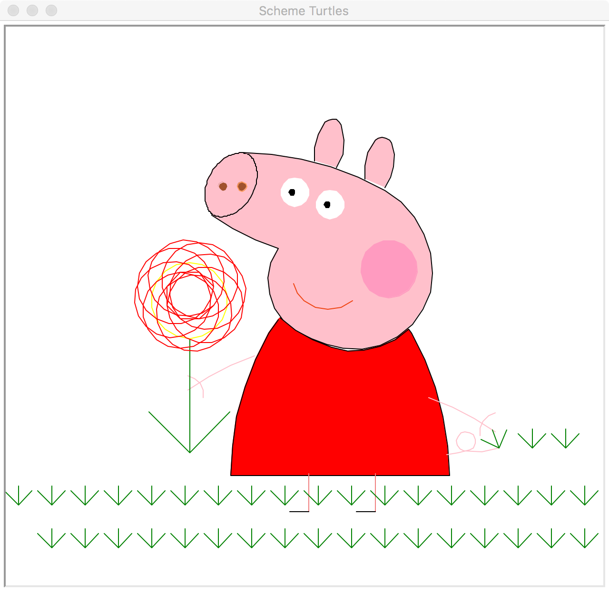

[1]:https://cs61a.org/proj/scheme_gallery/#peppaaaaaaa-pig
# Peppa-pig
Drawing a Peppa pig with scheme turtle!

**This is what you will get**


## How to run
In the directory, type this in the command line
```
$ python3 scheme.py peppa_pig.scm
```
The scheme turtle window should pop out, and the program runs.

## Files
- ```scheme.py ``` is the scheme interpreter
- ```contest.scm``` contains the code for the picture

## Published Website
- click [here][1] to view the online version
